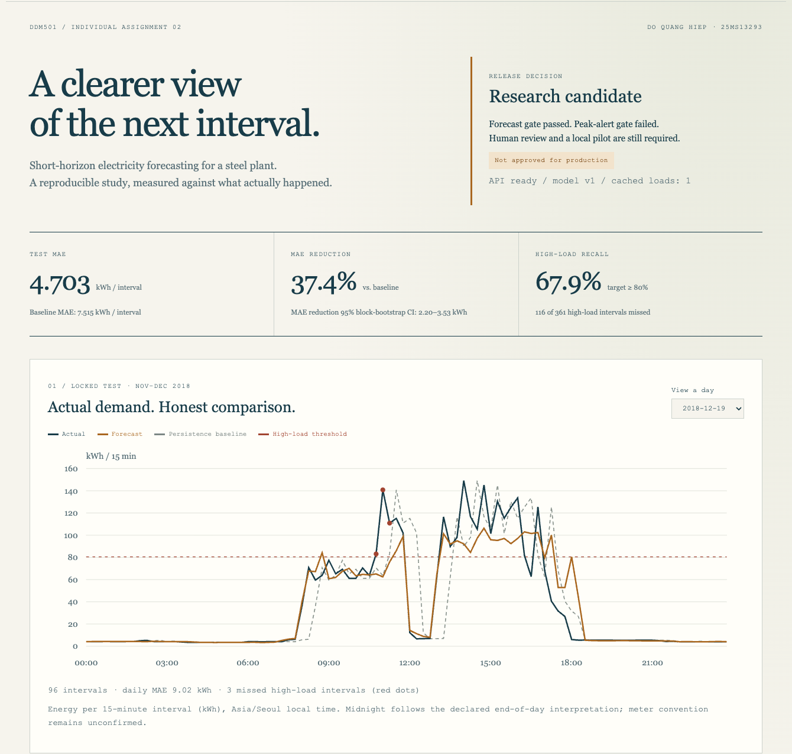

# DDM501 Assignment 2 - Steel Plant Energy Forecasting

**Do Quang Hiep - 25MS13293**

Repository: https://github.com/hiepdqflame/ddm501-assignment2-steel-energy

A Docker-first, reproducible ML pipeline using real public interval-energy data.
The project continues Assignment 1 and includes ten configurations, chronological
evaluation, MLflow tracking/registry, Airflow orchestration and a replay API.

## Submission and measured result

- [English report (20 pages)](report/DDM501_Assignment2_25MS13293_DoQuangHiep.pdf)
- [Five-minute demo walkthrough](docs/demo-walkthrough.md)
- [Executed checks and limitations](docs/verification.md)
- [Dataset provenance and CC BY 4.0 attribution](DATA_CARD.md)

The frozen E06 Random Forest achieves **4.703 kWh MAE**, versus **7.515 kWh** for
lag-2 persistence: a **37.4% reduction** on 5,856 held-out intervals. The forecast
gate passes; the high-load advisory gate fails. The model remains a research
candidate and does not control plant equipment.



This repository contains executable source, the original public dataset and the
author's reference evidence. Trained weights, local environments and databases
are excluded. Cloning and running the commands below trains a new local model.
The GitHub Actions workflow runs Docker checks on pushes and pull requests;
its actual status is visible in the repository's Actions tab after publication.

## Lecturer quick start

Requirements: Docker Desktop (Windows/macOS) or Docker Engine with Compose v2
(Linux), internet for the first image build, and approximately 6 GB free Docker
memory and 8 GB free disk. No host Python, Conda, database, MinIO or API key is
needed. Use Linux containers on Windows. The commands below clone the repository
and run the benchmark. If already cloned, start with the Docker commands inside
the repository folder. The included `.gitattributes` preserves dataset and
evidence bytes across operating systems:

```sh
git clone https://github.com/hiepdqflame/ddm501-assignment2-steel-energy.git
cd ddm501-assignment2-steel-energy
docker compose up -d --build mlflow
docker compose run --build --rm pipeline
```

The second command runs the complete benchmark, including all ten configurations
under both timestamp conventions, calibration, locked-test evaluation, chart
export and registered-model verification. The first build downloads dependencies;
the final verification also exports descriptive diagnostics and dashboard evidence.
training is CPU-only. The command exits with status zero when the pipeline succeeds.
An ML acceptance gate failing is an honest experimental outcome, not a software
failure; see `gates` in the final results.

Open **http://localhost:15030** for MLflow. Results persist on the host:

```text
artifacts/run/
  end_of_day/experiment-results.csv   # ten primary configurations
  end_of_day/fold-results.csv         # three temporal folds per configuration
  end_of_day/frozen.json              # model and alert policy fixed before test
  end_of_day/final-results.json       # locked test metrics and release gates
  end_of_day/test-predictions.csv     # all locked-test point predictions
  end_of_day/subgroup-results.csv     # monthly/weekend/high-load analysis
  literal/experiment-results.csv      # timestamp sensitivity, development only
  figures/                           # report-ready charts
  verification.json                  # actual registry round-trip check
  demo-request.json                  # strictly historical inference input
  demo-prediction.json
  integrity-ledger.json               # runtime fingerprint and sealed stage hashes
  engineering/analysis.json           # missed peaks and October permutation analysis
  engineering/dashboard.json          # generated dashboard evidence
```

`reference-results/` contains the author's measured evidence for comparison. It is
separate from generated outputs: **a fresh teacher run actually trains the models**
and creates its own MLflow runs and model version. Small floating-point and timing
differences between CPU architectures are expected. The raw dataset is bundled.

## Verify code and HTTP deployment

```sh
docker compose run --rm --no-deps pipeline python -m pytest tests -q
docker compose run --rm --no-deps pipeline ruff check steel_energy tests dags scripts
docker compose --profile demo up -d --wait api
docker compose run --rm --no-deps pipeline python scripts/check_api.py
```

Dashboard: **http://localhost:18030**. It runs without a CDN and shows the actual
test series, all ten development results, missed peaks, feature sensitivity,
release gates and a working historical replay button. Date selection covers all
61 test days. No live plant connection is implied.

API documentation: **http://localhost:18030/docs**. `GET /health` verifies the
model is present. `POST /predict` accepts the generated `demo-request.json` and
rejects missing, negative, non-finite, misaligned or future-contaminated histories.
Requests must contain exactly the latest 672 consecutive readings. A thread-safe
cache checks file metadata and the small manifest's actual bytes on each access,
verifies the model checksum when either changes, and loads each revision once.
Publish replacement model files atomically, then publish the manifest; never edit
an active model in place. Metadata alone cannot detect arbitrary same-size edits
on every filesystem. A broken replacement returns 503; valid input
errors return 422. The API never silently falls back to an old cached model.
The API is a historical benchmark replay; it does not control plant equipment.
The model's threshold-exceedance flag is diagnostic and is not a production alert.

## Run and inspect Airflow

```sh
docker compose --profile orchestration up -d --build --wait airflow
docker compose exec airflow cat /var/lib/airflow/standalone_admin_password.txt
```

Open **http://localhost:18081**, user `admin`, password from the previous command.
Two DAGs are available and initially paused:

- `steel_energy_research`: manually triggered, eight stages from validation and
  features through experiments, calibration, explicit final-test confirmation,
  charts and registry verification. Set `confirm_final` to `true` in the trigger
  form to reproduce the frozen evaluation. The default keeps the test locked.
- `steel_energy_evidence_monitor`: daily at 06:00 UTC if unpaused; verifies data,
  model and registry evidence. It does not retrain or open the test set.

An executable DAG integration check (after Airflow has initialised):

```sh
docker compose exec airflow /opt/airflow-venv/bin/airflow dags test steel_energy_research 2026-09-24 --conf '{"confirm_final": true}'
```

On a Windows shell that changes JSON quoting, use the Airflow trigger form. After
the CLI benchmark, completed stages safely reuse evidence only if data, relevant
source and configuration hashes match. The DAG invokes the same tested CLI through
`/usr/local/bin/python`; Airflow dependencies are isolated in their own virtual
environment. XCom does not carry DataFrames. Failure callbacks write structured
`PIPELINE_FAILURE` records with the task and log URL; external paging is a proposed
production integration, not an enabled email service.

## Experiment contract

- One meter, 15-minute interval kWh, forecast horizon 30 minutes to target end.
- Issue by `t + 1 minute` using measurements through interval end `t`; predict
  `[t + 15 minutes, t + 30 minutes)`. There are 14 minutes before the target starts.
- Feature row `j` uses energy `j-2` or earlier. Same-interval CO2, power factors,
  reactive energy and `Load_Type` are excluded.
- Expanding validation folds: July, August, September 2018. Primary selection:
  pooled MAE; choose the baseline and candidate before accessing the locked test.
- Refit through September, purging labels not yet available at the first October
  issue time. October is used only to calibrate a frozen alert margin.
- November-December is the final locked test. No model refitting or parameter
  selection uses those outcomes. Observed prior test readings may feed later
  predictions after their assumed arrival time, just as in live forecasting.
- All methods share the same warm-up exclusions. Fixed seed 42, single numerical
  thread, non-negative clipping and training-only standardisation for Ridge.
- The main timestamp convention moves each source day's trailing `00:00` to
  next-day midnight. This is an explicit assumption, not a verified meter manual.
  The sensitivity run sorts literal timestamps and never opens its test period.

Exact configurations: `config/experiment.yaml`. Derived code/config/data hashes,
runtime versions and model checksum are recorded in stage manifests and MLflow.
Completed stages reject changed identities rather than silently reusing stale
metrics. Do not edit code after viewing test results and call the same test unseen.

The supplemental integrity ledger seals completed-stage files and records the
lockfile, installed versions, Python, OS and CPU architecture. Altered completed
artifacts or an incompatible runtime require a new output directory. Files from
an incomplete stage remain retryable. For this engineering upgrade, the author's
pre-existing study was explicitly audited and adopted; original predictions,
manifests and source identity remain unchanged. **Fresh submissions need no
adoption command.** For an older local study only:

```sh
docker compose run --rm --no-deps pipeline python -m steel_energy.cli adopt-legacy
```

Adoption checks identities, runtime, feature content, saved development metrics,
calibration and frozen-model prediction parity. It records the audit in the ledger;
this is a consistency check, not a cryptographic signature proving historical
authenticity. Keep both model and manifests in trusted local storage.

## Engineering checks and supplementary analysis

```sh
docker compose run --rm --no-deps pipeline python scripts/integration_check.py
docker compose run --rm --no-deps pipeline python scripts/benchmark_http.py
docker compose run --rm --no-deps pipeline python -m steel_energy.cli analyze
```

Integration uses a disposable model/API instance, tests concurrent requests,
invalid inputs, corrupted bundles and recovery, then verifies HTTP MLflow registry
upload/download and a deliberately unavailable endpoint. It does not damage the
study or stop the running services. Temporary MLflow smoke runs are marked as
fixtures and soft-deleted after success. The benchmark needs the running demo API;
results include HTTP transport, parsing, feature construction and prediction.

`analyze` writes only `engineering/`: test error analysis is descriptive, while
grouped block permutation uses October calibration only, with the frozen model,
seven groups, 16-row blocks, five repeats and seed 42. It never refits or changes
selection, thresholds or final test predictions. Group correlations limit feature
interpretation; permutation variation is not a confidence interval.

GitHub Actions also builds the Airflow runtime and checks both DAGs, their task
count and the explicit final-test confirmation behavior. Equivalent checks are
executed locally in Docker; no hosted CI run is claimed. If the project is placed
inside a larger Git repository, configure Actions' working directory to this
folder (the included workflow assumes the submitted project is the repo root).

## Reproduce into a new output directory

Keep the original evidence and run a separate software reproduction:

```sh
docker compose run --rm -e OUTPUT_DIR=/app/artifacts/reproduction pipeline
```

This repeats a declared benchmark; it does not create a new scientifically unseen
holdout. Do not delete MLflow volumes while keeping cached stage manifests: those
manifests reference registered run IDs. If the registry was removed, rerun with a
new output directory as above to recreate the evidence and registered model.

## Configuration and service scope

No `.env` file is required. Copy `.env.example` to `.env` only to change conflicting
host ports. Internal service communication uses `http://mlflow:5000` and works
without host-specific IP addresses or `host.docker.internal`.

`OUTPUT_DIR`, `MLFLOW_TRACKING_URI` and `CONFIG_PATH` can override runtime settings.
Secrets are not stored in YAML or committed to source. The Compose services bind
their ports to loopback and use SQLite/named volumes for a small classroom demo.
This is not a high-availability production deployment. Multi-user production would
need authenticated endpoints, PostgreSQL, remote object storage, access controls
and a validated live-meter adapter. Airflow's standalone credentials are local demo
credentials and should not be reused outside the classroom.

```sh
docker compose --profile demo --profile orchestration down
```

This stops project services and preserves the named volumes. Other labs are not
touched. The `artifacts` bind mount remains on the host.

## Dataset and attribution

Sathishkumar V E, Changsun Shin and Yongyun Cho. **Steel Industry Energy Consumption**,
UCI Machine Learning Repository, DOI: **10.24432/C52G8C**.

- Source: https://archive.ics.uci.edu/dataset/851/steel+industry+energy+consumption
- Licence: https://creativecommons.org/licenses/by/4.0/
- Retrieved: 24 September 2026. Original CSV bytes are unchanged.
- 35,040 rows, 11 columns; no empty values or duplicate literal timestamps.
- SHA-256: `9b1cee6f9cb9cd9df2b95814ca90a9a2ff15b7f5f1fba0fae3c643e82072eacc`.

UCI identifies `Load_Type` as its target. This assignment intentionally reframes
the task as future `Usage_kWh` regression. Normalised timestamps and derived
features are project transformations and are not original source fields. Maintain
the attribution and mark modifications when redistributing derived data.

## Project map and assessed deliverables

Submit the English PDF and this public repository's URL. For an unambiguous
submission, also record the commit SHA or a release tag used for assessment.
The English submission PDF is in `report/`. To regenerate it from your completed
Docker run (optional; no host Python required):

```sh
docker compose run --rm --no-deps pipeline python report/build_report.py --evidence /app/artifacts/run --output /app/artifacts/DDM501_Assignment2_25MS13293_DoQuangHiep.pdf
```

The PDF appears in `artifacts/`. Standard PDF fonts are used in Linux; the author's
rendered report uses embedded macOS fonts, so line wrapping can differ slightly.
The included PDF is the visually reviewed submission artifact.

- `steel_energy/data.py`: source quality checks and features without future leakage.
- `steel_energy/experiments.py`: development, frozen calibration and final evaluation.
- `steel_energy/tracking.py`: actual MLflow setup, runtime provenance and metrics.
- `steel_energy/metrics.py`: regression/advisory metrics and release gates.
- `steel_energy/serving.py`, `api.py`: the saved-model prediction contract.
- `dags/`: research and evidence-monitoring DAGs.
- `tests/`: temporal boundary, invalid input, metric and serving regression tests.
- `requirements.lock`: resolved application versions; `constraints-airflow.txt`:
  official Airflow 2.10.5 / Python 3.12 constraints.
- `report/`: English report source and PDF builder.
- `docs/`: implementation plan, versioning strategy and verification evidence.

The design adapts ideas from the supplied Airflow tutorial and MLflow registry
labs: small XCom payloads, idempotent stages and registry aliases. The energy
features, chronological splits, study-freezing logic, metrics and report are
specific to this assignment. Source traceability is provided even in a ZIP without
Git metadata; a commit hash is recorded only when an actual repository supplies it.

## Troubleshooting

- **Docker daemon not running:** start Docker Desktop and wait for Engine ready.
- **Port already in use:** change the relevant port in `.env`, then restart services.
- **Initial download fails:** check Docker internet/proxy access; retry the build.
- **Memory pressure:** allocate more Docker memory; run only this project's services.
- **Changed identity error:** keep the old evidence and choose a new `OUTPUT_DIR`.
- **API returns 503:** complete the pipeline first; check `artifacts/run/end_of_day`.
- **Airflow DAG missing:** wait for parsing and inspect `docker compose logs airflow`.
- **Linux cannot edit generated files:** containers write as root for portable demo
  volume access; adjust ownership of `artifacts` with your local administrator.

Report acceptance targets are not promised outcomes. Forecast skill on this public
dataset does not demonstrate real factory savings; those require a prospective
pilot with production, tariff and operator-action records.
